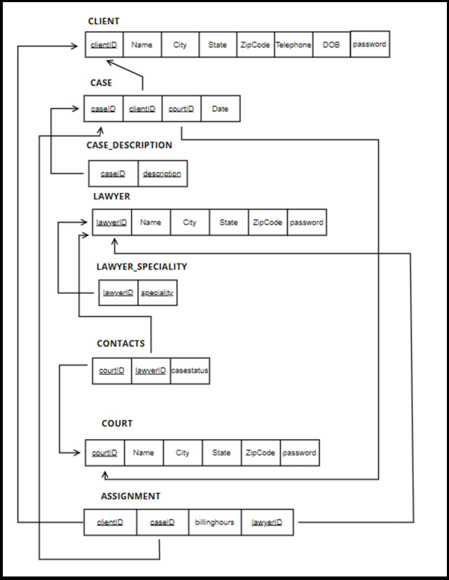
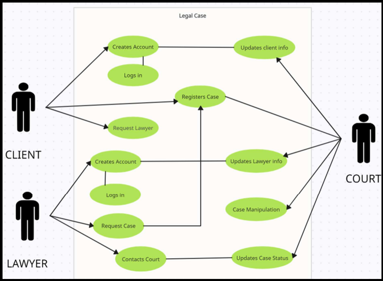
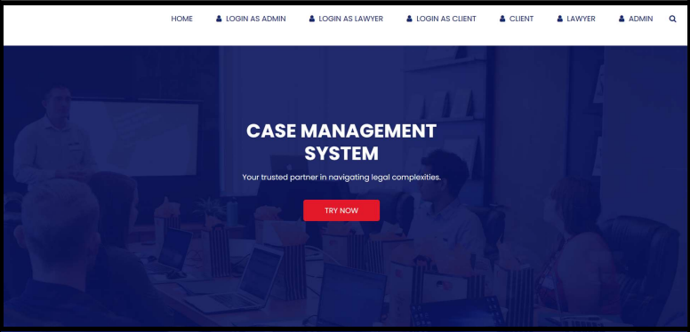

# Legal-Case-Management-System
A Legal Case Management System is an essential tool for law firms and legal departments which 
helps them organize and handle their cases more efficiently. This system simplifies tasks like 
tracking case details, managing client information and storing other important information 
securely. By using such a system, legal professionals can make their tasks easier, stay organized, 
and provide better service to their clients.
## REQUIREMENTS:
### BACKEND:
For this project we have opted for PhpMyAdmin which is a free and open-source administrative 
tool for MySQL and MariaDB. The programming language we have used to access this tool is PHP 
and JavaScript.
### FRONTEND:
The frontend design languages we have used are HTML, CSS, SCSS. Some frontend designs have 
been imported as templates from [Colorlib]( https://colorlib.com/).
### ER DIAGRAM:
The ER diagram of our database comprises of eight tables. A CLIENT, CASE and LAWYER are 
linked via an associated entity meaning all will be foreign keys in the ASSIGNMENT table. A 
number of cases can be registered in a single COURT. A LAWYER is in CONTACT with a 
COURT, the court can update case status for a case.

  

### SCHEMA DIAGRAM:
Here, we have a relational model of the ER diagram. All foreign keys are preferably mapped 
with tables having optional many cardinality and all multivalued attributes form new tables.

  

### USE CASE DIAGRAM:

  

## IMPLEMENTATION:
### STEP 1:  SQL CONNECTIVITY:
There are a total of eight tables in our database, first we established connectivity with our 
database and then created tables in PhpMyAdmin. Refer to project.txt file for all table queries in MariaDB format. Use Xampp to connect to PhpMy Admin, Login credientials are : Username root and no password.
### STEP 2: FRONT END
Create the front end design.

  

### STEP 3: BACK END
Write PHP to include SQL. This project performs the following:
1. DML Statements (INSERT, DELETE, CREATE, UPDATE)
2. Data Extraction

### THE ADMIN PANEL FOR LAWYER INFO:

  

